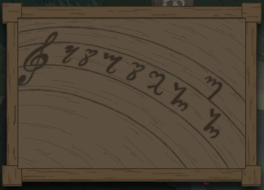
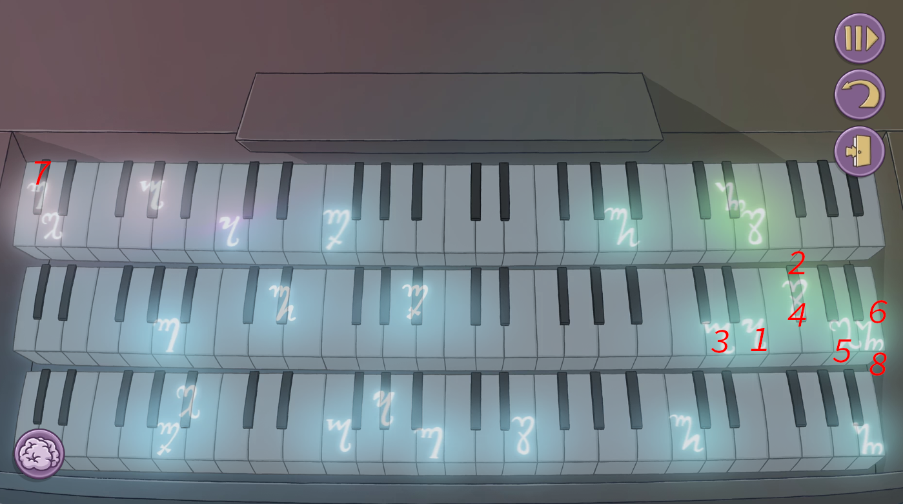

There's the organ in the church. Have you played it?

# I have
But you are just guessing. You need to make some sense into this.

# How?
The organ is quite dark. Maybe you could get more light into it.

# Light?
Go and [light up the lamp post at the alley](078-lamp-post.md).

# I got...
...symbols. Right. Now we need to find what symbols to play.

# How?
Have you visited other places? There might be a place under someone with symbols.

# Who?
The blacksmith, sitting on the stump. [Help him.](045-blacksmith.md)

# He is back home
Nice. Look at the stump he was sitting on. You get clues!

# Clues
It should be clear now. Go back to play the organ. You can skip the puzzle.

# Any hints?
You have to play the corresponding keys from the correct level. Find where are same keys on same level (top, middle or bottom).

# Can't do it
Play the following keys:

