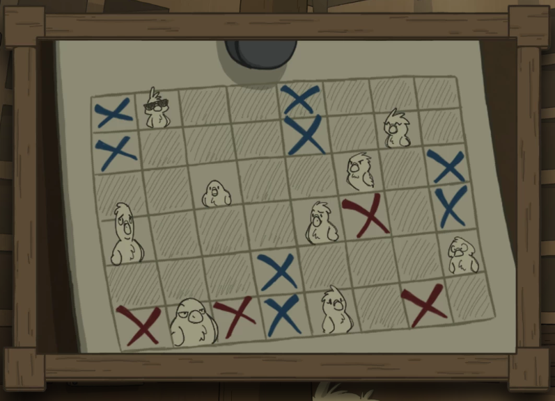
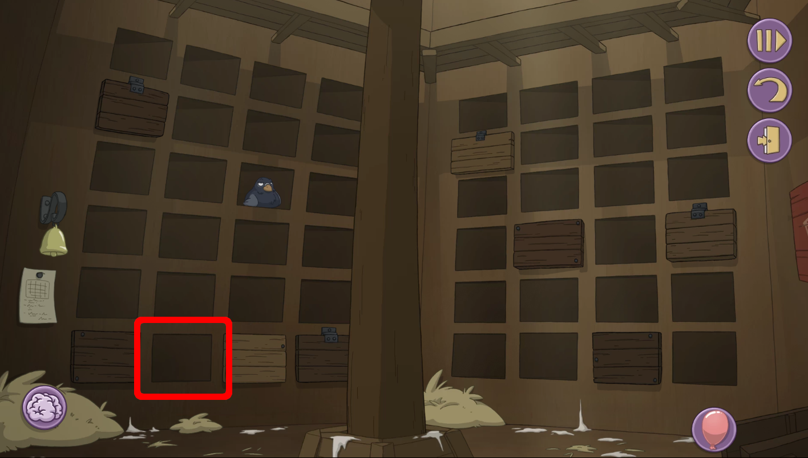
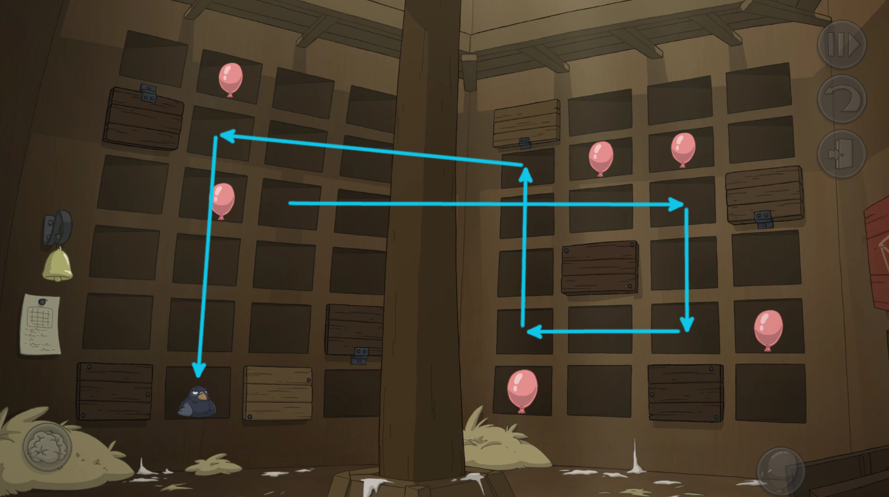

There is that pigeon to send some post. But it is out of reach.

# How to move it?
Read the note. It says you must refrain from any loud noises.

# Loud noises?
What would cause loud noise?

# What?
A balloon. Who would have one? ^[ Talk to Jester. She will give you balloons if you ask if she has any more tricks. ]

# I have a balloon!
Use it on the pigeon. It starts a mini puzzle.

# How to solve it?
Use the balloons to scare the pigeon. It will move as far as it gets in directional line away from the balloon. Try it out by putting a balloon into a pigeon hole next to the pigeon. You can flip the shutters by clicking them.

You can reset the puzzle from the bell.

# Where am I heading with it?
Look from the note. Look for a pigeon that looks like the one present.

# I don't understand.
Your goal is the hole in the bottom row, second from left.

# Help me!
I will show you the solution how to run the pigeon to correct hole.

# Show me
Notice the shutter positions.

